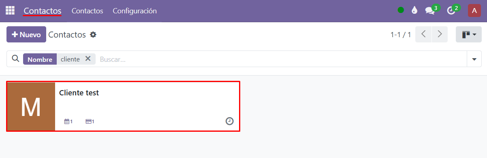
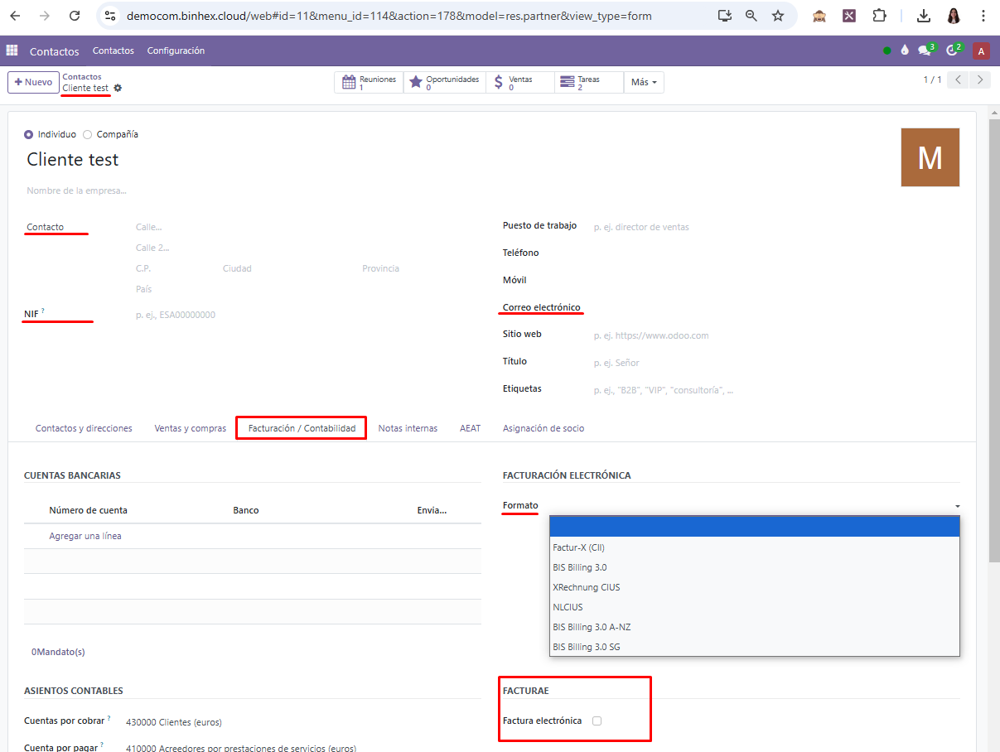
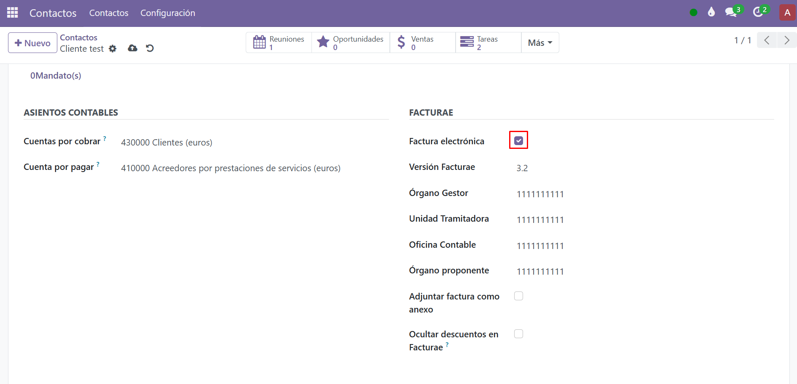
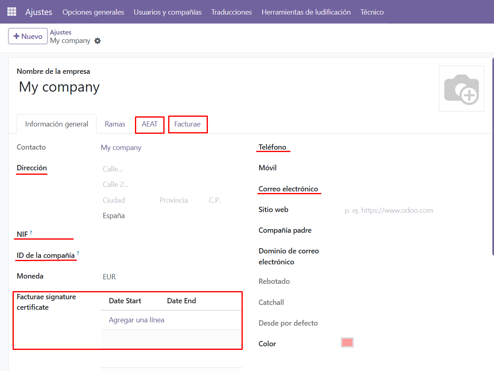
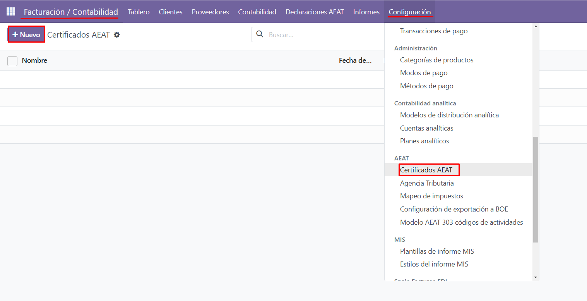

Pasos para comenzar a utilizar la facturación electrónica:

1. **Configurar los contactos a los que se emitirá facturación electrónica**

El primer paso es configurar los contactos de los clientes a los que se enviará la facturación electrónica. Para ello, diríjase al menú de **Contactos**, seleccione la **ficha del cliente** correspondiente y acceda a la sección de **Facturación/Contabilidad**, específicamente al apartado de **Facturae**.

Aquí debe **activar la casilla** correspondiente, seleccionar la **versión de Facturae** que utilizará y añadir los **códigos** necesarios para completar esta configuración.

2. **Completar la información de la compañía propia:**

Una vez configurados los contactos, es importante asegurarse de que la información de su propia compañía esté completa. Para ello, acceda a la ficha de su empresa en **ajustes** y añada todos los datos requeridos, incluyendo la **versión de Facturae** que utilizará.

Este paso es fundamental para que las facturas electrónicas se generen correctamente y cumplan con los estándares exigidos.

3. **Añadir el certificado digital:**

El siguiente paso es cargar el certificado digital, que es indispensable para firmar las facturas electrónicas. Vaya a la sección de **Facturación/Contabilidad**, acceda al apartado de **Configuración** y seleccione Certificados AEAT.

En esta pantalla, haga clic en **Nuevo** para crear un registro para su certificado.

Asígnele un nombre y suba el archivo correspondiente. Una vez cargado el certificado, haga clic en la opción de **Obtener claves** y guarde los cambios.

