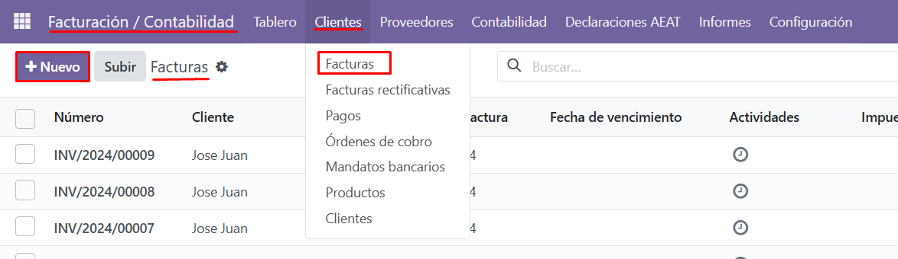
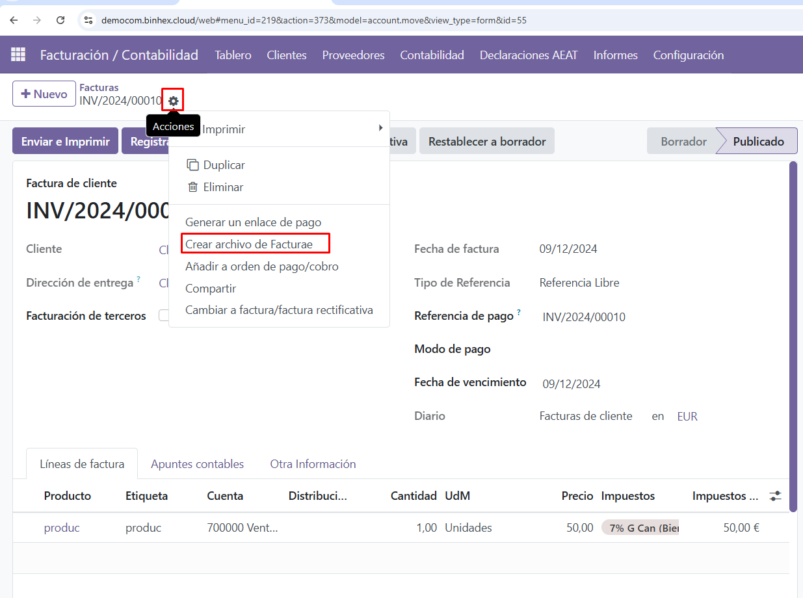
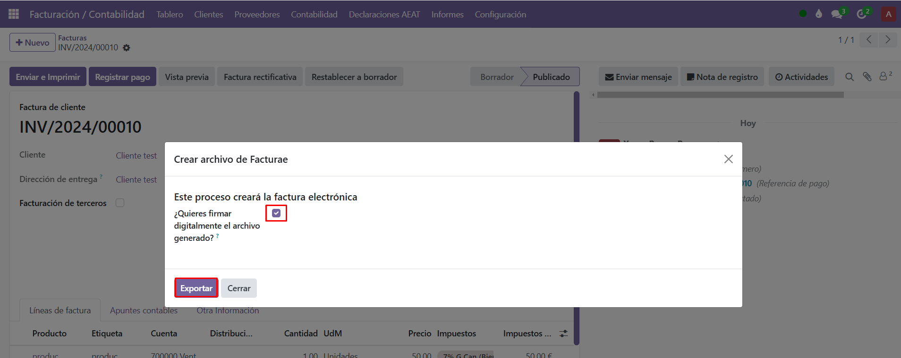

**Descargue el archivo de facturae**

Con la configuración lista, ya puede proceder a emitir sus facturas electrónicas. Para ello, acceda a **Facturación/Contabilidad**, entre en el menú de **Clientes** y seleccione **Facturas**.

Haga clic en **Nuevo** para crear una nueva factura. Complete toda la información necesaria, guarde los datos, y luego seleccione el icono de **engranaje de Acción**.

Aquí encontrará la opción para descargar el archivo de la factura electrónica. Si es necesario, firme el archivo antes de descargarlo.

Finalmente, una vez que tenga el archivo listo, puede subirlo al portal **FACe** para completar el proceso.

